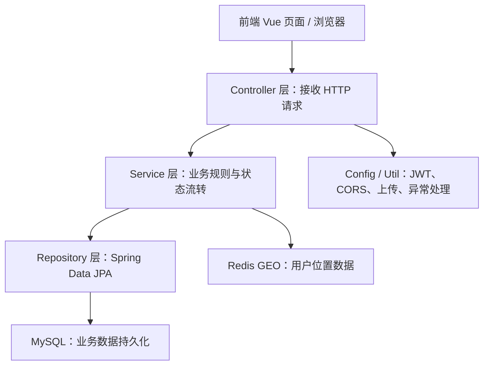
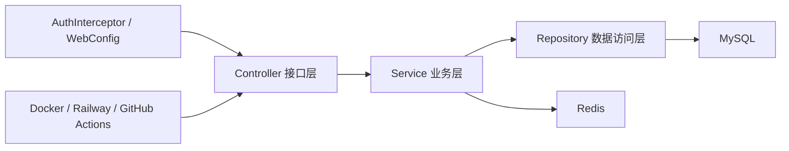
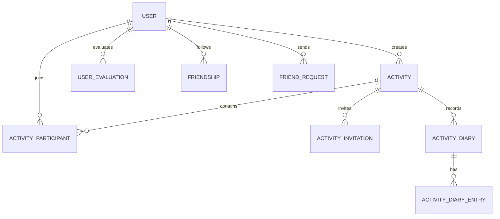
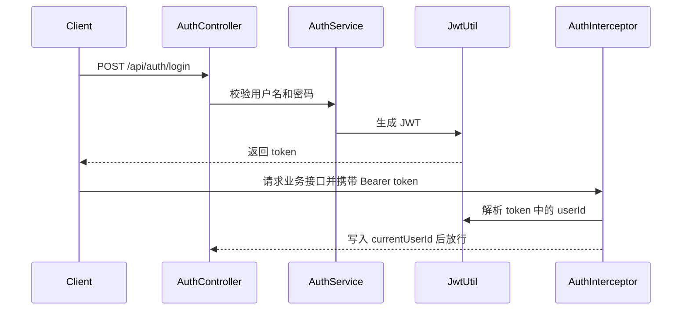
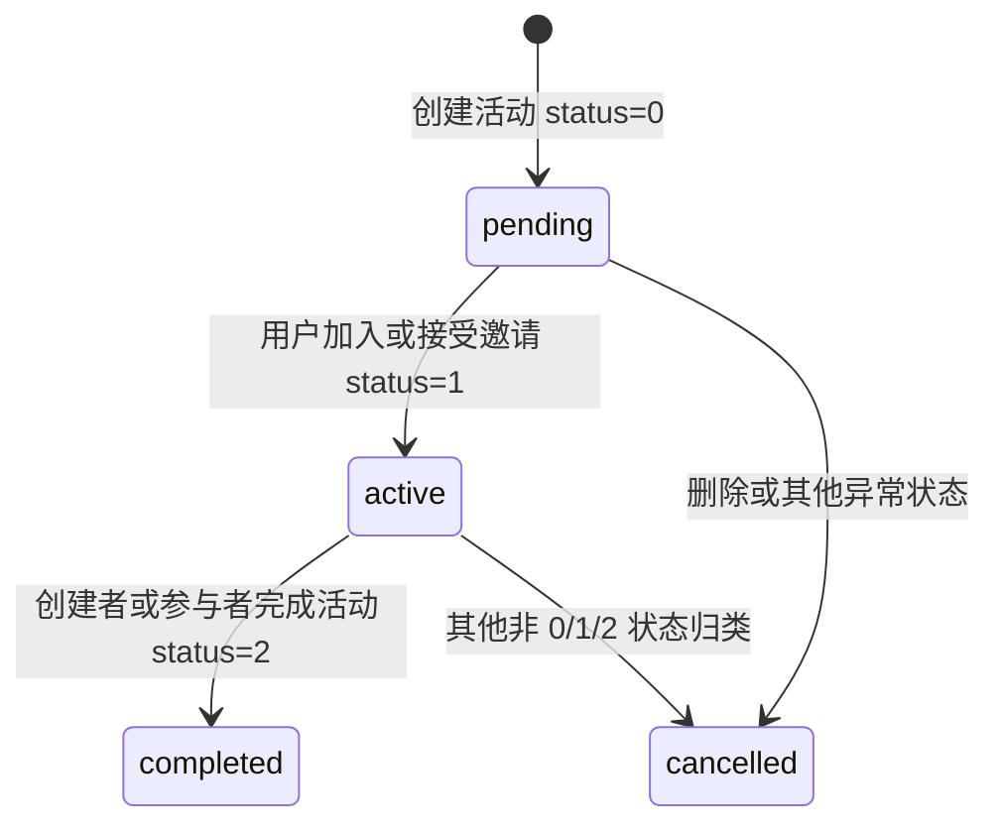

# FunMate Planet 后端开发文档

项目名称：趣搭星球 FunMate Planet  
后端负责范围：后端服务、数据库与 Redis、测试、Docker/云部署、后端相关安全与监控  
主要负责人：彭静婷  
  


## 1. 后端职责概述

负责人：彭静婷

后端是 FunMate Planet 的业务核心，负责向前端提供 REST API，并承担以下职责：

1. 用户注册、登录、JWT 令牌生成和鉴权。
2. 用户资料维护，包括昵称、头像、标签、简介、年龄、性别和地理位置。
3. 基于 Redis GEO 的附近用户搜索。
4. 活动创建、修改、删除、加入、完成和“我的活动”分组查询。
5. 活动邀请、好友申请、好友关系和聊天消息。
6. 活动日记创建、日记参与者展示、多人共享日记 entry。
7. 用户评价、活动评价排行榜。
8. 图片上传、静态资源映射。
9. 健康检查、数据库与 Redis 连通性检查。
10. 后端单元测试、接口测试、JaCoCo 覆盖率统计、GitHub Actions CI。
11. Docker 本地部署和 Railway 云端部署适配。

后端采用常见的分层结构：



这种结构的好处是职责清晰：Controller 不直接写复杂业务逻辑，Service 负责业务判断，Repository 负责数据访问，Config/Util 处理通用能力。


## 2. 后端技术选型

负责人：彭静婷

后端使用 Java 21 和 Spring Boot。项目的依赖以 `backend/pom.xml` 为准，核心依赖如下。

| 技术或库 | 当前项目使用情况 | 作用 |
| --- | --- | --- |
| Java | 21 | 后端运行语言和编译目标 |
| Spring Boot | 3.4.3 | Web 应用基础框架，提供自动配置和内嵌运行能力 |
| Spring Web | 由 `spring-boot-starter-web` 引入 | 实现 REST API、Controller、请求响应处理 |
| Spring Data JPA | 由 `spring-boot-starter-data-jpa` 引入 | 通过 Repository 访问 MySQL |
| Hibernate | 由 Spring Data JPA 间接引入 | ORM 映射，配合 JPA 实体自动建表和更新字段 |
| Spring Data Redis | 由 `spring-boot-starter-data-redis` 引入 | 访问 Redis，支持 Redis GEO 附近搜索 |
| MySQL Connector/J | 运行时依赖 | 连接 MySQL 数据库 |
| JJWT | 0.12.3 | 生成和解析 JWT |
| Spring Security Crypto | 随依赖引入 | 使用 BCrypt 加密密码 |
| Lombok | 编译期可选依赖 | 简化实体类 getter、setter 等样板代码 |
| H2 | 测试依赖 | 测试环境内存数据库 |
| JUnit 5 / Mockito / MockMvc | 由 `spring-boot-starter-test` 引入 | 后端单元测试、Mock 依赖、Controller 测试 |
| JaCoCo | 0.8.11 | 生成后端测试覆盖率报告 |

需要特别说明的是，`pom.xml` 中存在 `openai-java 2.8.0` 依赖，但当前 `AiService` 实际调用 AI 服务时使用的是 Java 标准库 `java.net.http.HttpClient` 手动请求 OpenAI 兼容的 `/chat/completions` 接口，没有直接使用 OpenAI Java SDK 封装。


## 3. 后端系统架构

负责人：彭静婷

后端整体可以分为接口层、业务层、数据访问层、基础配置层和运行部署层。



### 3.1 Controller 层

Controller 层负责接收前端请求、读取路径参数或请求体、调用 Service，并把结果包装为统一响应。项目中典型 Controller 包括：

| Controller | 主要职责 |
| --- | --- |
| `AuthController` | 注册、登录、登出、当前用户信息 |
| `UserController` | 用户资料查询、更新、删除、位置上报 |
| `DiscoverController` | 附近用户、排行榜、随机用户、位置更新 |
| `ActivityController` | 活动创建、查询、加入、完成、我的活动 |
| `ActivityInvitationController` | 活动邀请创建、查询、处理 |
| `FriendController` | 好友申请、好友列表、删除好友 |
| `ChatController` | 会话列表、消息查询、发送、删除 |
| `DiaryController` | 活动日记创建、详情、共享 entry、删除 |
| `EvaluationController` | 用户评价创建、查询、更新、删除 |
| `UploadController` | 图片上传 |
| `HealthController` | `/health` 健康检查 |
| `TestConnectionController` | MySQL 和 Redis 连通性检查 |

### 3.2 Service 层

Service 层负责业务规则，例如：

- 活动只有创建者可以修改或删除。
- 用户不能邀请自己参加活动。
- 活动邀请只能发送给已有好友。
- 日记只有作者或活动参与者可以访问。
- 聊天消息只有发送者可以删除。
- 位置查询优先使用 Redis GEO，查询不到时使用评分排序兜底。

### 3.3 Repository 层

Repository 层继承 `JpaRepository`，负责 MySQL 数据访问。多数查询通过 Spring Data JPA 方法命名生成，例如 `findByUserId`、`findByActivityId`、`findByCreatorIdAndStatus`。个别复杂查询使用 `@Query`，例如活动日记相关查询会通过活动参与者关联查出当前用户可见的日记。

### 3.4 基础配置层

基础配置层包括：

- `AuthInterceptor`：解析 JWT 并写入 `currentUserId`。
- `WebConfig`：注册拦截器、配置 CORS、映射 `/static/**` 静态资源。
- `RedisConfig`：配置 RedisTemplate 序列化。
- `GlobalExceptionHandler`：处理异常。
- `MultipartContentTypeFilter`：增强 multipart 请求兼容性。


## 4. 数据模型设计

负责人：彭静婷

项目使用 Spring Data JPA 和 Hibernate 管理数据模型，配置文件中 `spring.jpa.hibernate.ddl-auto=update`，启动时会根据实体类同步数据库表结构。以下字段以当前 `backend/src/main/java/com/zjgsu/pjt/backend/entity` 中的实体类为准。

### 4.1 核心实体关系



### 4.2 `user` 用户表

对应实体：`User.java`

用户表保存登录账号、用户资料、兴趣标签、经纬度和好评率。

| 字段 | 说明 |
| --- | --- |
| `id` | 用户主键 |
| `username` | 登录用户名，唯一且非空 |
| `password` | BCrypt 加密后的密码 |
| `nickname` | 昵称 |
| `avatar` | 头像 URL |
| `age` | 年龄 |
| `gender` | 性别 |
| `tags` | 兴趣标签，当前以逗号分隔字符串保存 |
| `bio` | 个人简介 |
| `longitude` / `latitude` | 用户经纬度，MySQL 中保存一份，Redis GEO 中也保存一份用于附近搜索 |
| `average_score` | 好评率或排序分数 |
| `create_time` | 注册时间 |

### 4.3 `activity` 活动表

对应实体：`Activity.java`

活动表保存活动标题、描述、计划、时间、地点、人数限制和状态。

| 字段 | 说明 |
| --- | --- |
| `id` | 活动主键 |
| `creator_id` | 创建者用户 ID |
| `title` | 活动标题，非空 |
| `description` | 活动描述 |
| `plan` | 活动计划，TEXT，可为空 |
| `activity_time` | 活动时间 |
| `location` | 活动地点 |
| `max_participants` | 最大参与人数 |
| `status` | 活动状态，0 为 pending，1 为 active，2 为 completed，其他状态归入 cancelled |
| `create_time` | 创建时间 |
| `inviteeId` | `@Transient` 字段，不落库，只用于创建活动时携带被邀请人 ID |

### 4.4 活动参与和邀请表

对应实体：`ActivityParticipant.java`、`ActivityInvitation.java`

`activity_participant` 用来表示某个用户已经参与某个活动。创建活动时，后端会把创建者自动加入参与表。用户加入活动或接受活动邀请时，也会写入参与表。

`activity_invitation` 用来表示活动邀请。邀请包含发送者、接收者、活动 ID、状态和处理时间。当前状态值主要包括 `pending`、`accepted`、`declined`、`expired`、`cancelled`。

### 4.5 日记表和日记条目表

对应实体：`ActivityDiary.java`、`ActivityDiaryEntry.java`

`activity_diary` 保存一次活动日记的主信息，包括作者、活动 ID、标题、内容、图片和标签。`activity_diary_entry` 保存每个参与者自己的共享内容。这样一个活动日记可以有多个参与者 entry，用于多人共享日记页面。

### 4.6 评价和排行榜相关表

对应实体：`UserEvaluation.java`、`ActivityReview.java`

`user_evaluation` 使用 1、2、3 三档评价，`EvaluationService` 会在创建、修改、删除评价后重新计算目标用户的好评率。  
`activity_review` 使用 `rating` 字段记录活动评价，`ActivityService.getTopParticipants()` 会按被评价用户分组计算平均评分，生成活动排行榜。

### 4.7 好友、关注和聊天相关数据

对应实体：`FriendRequest.java`、`Friendship.java`

好友申请表保存发送者、接收者、申请状态。好友关系表保存 `userId` 和 `friendId` 的关系。当前代码中好友列表会要求双向 friendship 都存在，才认为是好友。

聊天模块当前由 `ChatService` 使用 `ConcurrentHashMap` 在内存中保存消息，不是 MySQL 持久化消息表。因此本文档不把聊天消息表描述为已实现数据库表。此处是当前实现的限制，后续如需生产化，应改为数据库或 Redis Stream 持久化。


## 5. 核心业务实现

负责人：彭静婷

### 5.1 用户认证与 JWT 鉴权

注册接口位于 `AuthController.register()`，业务由 `AuthService.register()` 完成。注册时先检查用户名是否已存在，如果不存在，则用 `BCryptPasswordEncoder` 对明文密码加密后保存到数据库。

登录接口位于 `AuthController.login()`，业务由 `AuthService.login()` 完成。登录时根据用户名查找用户，用 `passwordEncoder.matches()` 校验密码。校验通过后，`JwtUtil.generateToken()` 生成 JWT，并把 token 返回给前端。

鉴权逻辑集中在 `AuthInterceptor.preHandle()`。拦截器会放行登录、注册、测试等白名单接口，也会直接放行浏览器 CORS 预检所需的 `OPTIONS` 请求。其他 `/api/**` 请求必须携带 `Authorization: Bearer <token>`。拦截器解析 token 后，把用户 ID 写入 request attribute，名称为 `currentUserId`。后续 Controller 通过 `@RequestAttribute("currentUserId")` 获取当前登录用户，避免前端伪造用户 ID。

简化流程如下：



### 5.2 Redis GEO 附近搜索

附近搜索是移动计算场景中最核心的后端能力。用户位置通过接口上报后，后端把位置写入 MySQL，同时写入 Redis GEO 集合。Redis key 固定为 `user:location`，member 是用户 ID，value 是经纬度点。

位置写入的核心逻辑在 `UserService.updateLocation()` 和 `DiscoverService.updateUserLocation()`：

```java
opsForGeo().add("user:location", new Point(longitude, latitude), String.valueOf(userId));
```

附近查询的核心逻辑在 `DiscoverService.getNearbyUsers()`。该方法接收经度、纬度和半径，构造 `Point`、`Distance` 和 `Circle`，然后调用 Redis GEO 的 radius 查询。查询结果是用户 ID 列表，再通过 `userRepository.findAllById(ids)` 查询完整用户资料。

如果 Redis 没有结果或查询失败，后端会使用 MySQL 中 `averageScore` 排序的前 20 个用户作为兜底结果，避免前端找搭子页面出现空白。

需要说明的是，后端半径不是写死 5km，而是由请求参数 `radius` 控制。产品上可以传 5 表示 5km 圈层，当前部分前端页面默认传 10，演示场景中也出现过更大的半径以保证能搜索到数据。

### 5.3 用户标签

用户标签保存在 `User.tags` 字段中，当前是逗号分隔字符串。`UserService.buildProfile()` 构造用户画像时，会调用 `parseTags()` 将字符串拆成 `List<String>` 返回给前端。

当前后端已经实现标签数据的保存、更新、解析和返回。严格来说，复杂的“标签相似度排序算法”没有完全下沉到后端 Service 中；当前更多是前端基于后端返回的标签做展示和筛选。因此文档只描述已实现的标签存储与解析，不把未完成的复杂推荐算法写成已完成。

后续如果继续优化，可以在 `DiscoverService` 中计算共同标签数或 Jaccard 相似度，再结合距离和评分做综合排序。

### 5.4 活动生命周期

活动模块由 `ActivityController`、`ActivityService` 和 `ActivityRepository` 实现。

活动创建时，Controller 从 JWT 中解析出的 `currentUserId` 写入 `creatorId`，Service 默认设置 `status=0`，保存活动后通过 `internalJoin()` 把创建者加入 `activity_participant`。如果请求中存在 `inviteeId`，会同时创建活动邀请。

活动状态流转如下：



`GET /api/activities/my` 会返回当前登录用户相关的所有活动，并按 status 分组。查询逻辑包括三部分：

1. 从 `activity_participant` 查询当前用户参与的活动。
2. 查询当前用户收到的 pending 活动邀请，把被邀请活动也加入结果。
3. 查询当前用户自己创建的 pending 活动，防止刚创建但还没有其他参与者时前端看不到。

返回结构分为 `pending`、`active`、`completed`、`cancelled` 四组。

活动详情接口 `GET /api/activities/{id}` 会返回活动信息、参与者列表、参与人数和 `hasJournal`。其中 `hasJournal` 来自 `ActivityDiaryRepository.existsByActivityId()`，用于判断该活动是否已经创建日记。

### 5.5 活动邀请

活动邀请由 `ActivityInvitationService` 实现。创建邀请时会进行多项校验：

- 发送者不能邀请自己。
- 活动必须存在。
- 只有活动创建者可以发送邀请。
- 被邀请用户必须存在。
- 双方必须已经是好友。
- 被邀请用户不能已经是参与者。
- 同一活动对同一用户不能重复创建 pending 邀请。

邀请创建成功后，后端还会调用 `ChatService.sendMessage()` 给对方发送一条活动邀请消息。接受邀请时，后端会检查活动是否满员，如果未满员则创建 `ActivityParticipant` 记录，并把活动状态置为 active。

### 5.6 好友关系

好友模块由 `FriendService` 和 `FriendshipService` 实现。好友申请表记录申请发送者、接收者和状态。处理申请时，只有接收者可以同意或拒绝。若接收者同意，后端会创建双向 `Friendship` 记录，因此好友关系在当前业务中被视为双向关系。

关注模块也使用 `Friendship` 表，但语义上是单向关注。好友列表中会过滤出双向关系，关注列表和粉丝列表则按单向关系查询。

### 5.7 聊天消息

聊天接口由 `ChatController` 暴露，业务由 `ChatService` 处理。当前实现使用 `ConcurrentHashMap<Long, List<Map<String, Object>>>` 存储消息，发送消息时同时写入发送者和接收者的消息列表。消息包含 id、senderId、receiverId、content、createTime 和 isRead。

当前聊天是演示级实现，不做数据库持久化，也没有 WebSocket 实时推送。删除消息时后端会校验当前用户是否为消息发送者，防止水平越权。

### 5.8 活动日记与多人共享 entry

日记模块由 `DiaryController` 和 `DiaryService` 实现。创建日记时支持 JSON 请求，也支持 multipart 上传图片。日记保存后，`bootstrapDiaryEntries()` 会根据活动参与者初始化每个用户自己的 `ActivityDiaryEntry`。如果没有活动参与者，则至少为日记作者创建 entry。

日记详情接口会返回：

- `diary`：日记主体。
- `participants`：活动参与者。
- `participantCount`：参与者数量。
- `sharedEntries`：每个参与者对应的共享 entry。

访问控制由 `DiaryService.canAccessDiary()` 实现。日记作者可以访问；如果日记关联了活动，则活动参与者也可以访问。

### 5.9 评价与排行榜

用户评价由 `EvaluationService` 处理。创建、更新或删除评价时，后端会重新计算目标用户的好评率。当前好评率定义为：评分等级为 3 的评价数量除以有效评价总数，再换算为百分比。

活动排行榜由 `ActivityService.getTopParticipants()` 实现。该方法读取全部 `ActivityReview`，按 `revieweeId` 分组，计算每个被评价用户的平均 rating，补充用户昵称和头像后按分数降序返回前 10 名。

### 5.10 AI 活动建议

AI 接口由 `AiController` 和 `AiService` 实现。`POST /api/ai/suggest` 接收 `tags`、`location`、`query`，Service 拼接系统提示词和用户问题后，用 Java `HttpClient` 调用 OpenAI 兼容的 `/chat/completions` 接口。

AI 服务地址、模型和密钥通过环境变量配置：

- `AI_BASE_URL`
- `AI_API_KEY`
- `AI_MODEL`

当前默认配置指向 DeepSeek 兼容接口。由于 AI 结果依赖外部服务和密钥，后端在异常、超时、401、429 等情况下会返回可读错误提示。

### 5.11 图片上传和静态资源

图片上传接口由 `UploadController` 和 `UploadService` 实现。上传时后端检查文件是否为空，生成 UUID 文件名，保存到 `upload.dir` 指定目录，并返回 `upload.url + filename`。

`WebConfig.addResourceHandlers()` 将 `/static/**` 映射到上传目录，浏览器可以通过静态 URL 访问上传文件。


## 6. 主要接口说明

负责人：彭静婷

本文档列出本人负责后端的主要接口。统一响应结构由 `Result<T>` 提供，成功时当前代码使用 `code=0`，message 为 `success` 或 `created`；失败时 `code` 为对应错误码，data 为 null。

| 模块 | 方法与路径 | 说明 |
| --- | --- | --- |
| 认证 | `POST /api/auth/register` | 注册用户，密码 BCrypt 加密 |
| 认证 | `POST /api/auth/login` | 登录并返回 JWT |
| 认证 | `GET /api/auth/me` | 获取当前登录用户基础信息 |
| 用户 | `GET /api/users/me` | 获取当前用户画像 |
| 用户 | `PUT /api/users/me` | 更新当前用户资料 |
| 用户 | `POST /api/users/location` | 上报当前用户位置 |
| 发现 | `GET /api/discover/nearby` | 根据经纬度和半径查询附近用户 |
| 发现 | `GET /api/discover/ranking` | 按评分返回用户排名 |
| 发现 | `GET /api/discover/random` | 随机返回一个用户 |
| 活动 | `POST /api/activities` | 创建活动 |
| 活动 | `GET /api/activities` | 分页查询活动 |
| 活动 | `GET /api/activities/my` | 查询我的活动并按状态分组 |
| 活动 | `GET /api/activities/{id}` | 活动详情，包含参与者和 hasJournal |
| 活动 | `POST /api/activities/{id}/join` | 加入活动 |
| 活动 | `POST /api/activities/{id}/complete` | 完成活动 |
| 活动邀请 | `POST /api/activity-invitations` | 创建活动邀请 |
| 活动邀请 | `GET /api/activity-invitations` | 查询我的 incoming/outgoing 邀请 |
| 活动邀请 | `POST /api/activity-invitations/{id}/handle` | 接受或拒绝邀请 |
| 好友 | `POST /api/friends/requests` | 发送好友申请 |
| 好友 | `POST /api/friends/requests/{id}/handle` | 处理好友申请 |
| 聊天 | `GET /api/chat/conversations` | 会话列表 |
| 聊天 | `GET /api/chat/messages` | 消息列表 |
| 聊天 | `POST /api/chat/messages` | 发送消息 |
| 日记 | `POST /api/diaries` | 创建活动日记 |
| 日记 | `GET /api/diaries` | 查询当前用户相关日记 |
| 日记 | `GET /api/diaries/{id}` | 日记详情和共享 entry |
| 日记 | `PUT /api/diaries/{id}/entries/me` | 更新自己的共享 entry |
| 评价 | `POST /api/evaluations` | 创建用户评价 |
| 上传 | `POST /api/upload/image` | 上传图片 |
| 健康检查 | `GET /health` | 后端健康检查 |
| 连通性 | `GET /api/test/connection/all` | 检查 MySQL 和 Redis |


## 7. 安全设计

负责人：彭静婷

### 7.1 密码安全

用户密码不会明文保存。注册时 `AuthService` 使用 `BCryptPasswordEncoder.encode()` 加密密码，登录时用 `matches()` 校验。

### 7.2 JWT 鉴权

后端使用 JJWT 生成 JWT。token 的 subject 保存用户 ID，过期时间由 `jwt.expire-seconds` 控制，默认值为 86400 秒。除白名单接口外，业务接口必须通过 `AuthInterceptor` 校验。

### 7.3 水平越权防护

项目在多个模块中加入了 currentUserId 校验：

- 用户资料更新时只能更新自己。
- 删除用户时只能删除自己。
- 活动更新和删除要求当前用户是创建者。
- 活动邀请要求发送者是活动创建者，接收者是当前用户才能处理邀请。
- 日记访问要求是作者或活动参与者。
- 评价修改和删除要求当前用户是评价者。
- 聊天消息删除要求当前用户是发送者。

### 7.4 CORS

`WebConfig` 从 `cors.allowed-origins` 读取允许来源，实际值可通过 `CORS_ALLOWED_ORIGINS` 环境变量配置。这样本地和云端可以使用不同前端域名。

### 7.5 当前限制

当前项目没有使用完整的 Spring Security Filter Chain，而是使用自定义 `HandlerInterceptor` 实现 JWT 鉴权。该方案适合课程项目和当前 REST API，但如果后续扩展为更复杂的权限模型，可以迁移到 Spring Security 的认证授权体系。


## 8. 测试设计与结果

负责人：彭静婷

后端测试使用 JUnit 5、Mockito、MockMvc、H2 和 JaCoCo。测试文件位于 `backend/src/test/java`。

### 8.1 测试类型

| 测试类型 | 使用工具 | 覆盖内容 |
| --- | --- | --- |
| Service 单元测试 | JUnit 5 + Mockito | 活动状态流转、邀请处理、评价更新、日记共享、附近搜索逻辑 |
| Controller 测试 | MockMvc + Mockito | API 入参、响应结构、状态码和权限分支 |
| 工具类测试 | JUnit 5 | JWT、文件上传等工具逻辑 |
| 配置类测试 | JUnit 5 + Mockito | 拦截器、CORS、初始化数据、异常处理 |
| 覆盖率统计 | JaCoCo | 生成 `target/site/jacoco` 报告 |

### 8.2 已覆盖的关键风险点

1. 登录注册和 JWT 解析是否正常。
2. 活动创建后创建者是否自动加入活动。
3. 活动详情是否返回 `hasJournal`。
4. `/api/activities/my` 是否按 status 分组。
5. 活动邀请是否要求好友关系。
6. 日记是否按参与者生成共享 entry。
7. Redis GEO 查询失败时是否有兜底结果。
8. CORS 预检 OPTIONS 是否放行。
9. 文件上传空文件和异常分支是否处理。

### 8.3 当前覆盖率

最近一次本地 JaCoCo 报告中的后端总体指标为：

| 指标 | 覆盖率 |
| --- | --- |
| Instruction Coverage | 74.2% |
| Line Coverage | 76.9% |
| Method Coverage | 85.5% |
| Branch Coverage | 51.2% |
| Complexity Coverage | 54.1% |

覆盖率报告路径：

```text
backend/target/site/jacoco/index.html
backend/target/site/jacoco/jacoco.csv
```

测试命令：

```bash
cd backend
mvn clean test -DskipTests=false
```


## 9. 部署设计

负责人：彭静婷

### 9.1 本地 Docker 部署

本地部署使用 `docker-compose.yml`，包含 MySQL、Redis、Ollama、backend 和 frontend 服务。后端依赖 MySQL 和 Redis 的 healthcheck，只有数据库和 Redis 健康后才启动后端。

后端容器读取的主要环境变量包括：

| 环境变量 | 作用 |
| --- | --- |
| `DB_HOST` / `DB_PASSWORD` | 本地 MySQL 连接 |
| `REDIS_HOST` | 本地 Redis 地址 |
| `AI_API_KEY` / `AI_BASE_URL` / `AI_MODEL` | AI 服务配置 |

`backend/Dockerfile` 当前是运行时镜像方案：先在宿主机把 backend 打成 jar，再由 Dockerfile 把 jar 复制进运行镜像。这是为了避免本地容器内 Maven 下载依赖受网络影响。

### 9.2 Railway 后端云部署

云部署使用根目录下的 `Dockerfile.railway` 和 `railway.toml`。`Dockerfile.railway` 是多阶段构建：第一阶段使用 Maven 镜像编译 jar，第二阶段使用 Liberica OpenJDK Alpine 运行 jar。

`railway.toml` 指定：

- 使用 Dockerfile 构建。
- Dockerfile 路径为 `Dockerfile.railway`。
- 后端健康检查路径为 `/health`。
- 健康检查超时时间为 300 秒。

云端需要配置的关键环境变量包括：

| 环境变量 | 作用 |
| --- | --- |
| `DATABASE_URL` 或 `MYSQLHOST` 等拆分变量 | MySQL 连接 |
| `REDIS_URL` | Redis 连接 |
| `JWT_SECRET` | JWT 签名密钥 |
| `CORS_ALLOWED_ORIGINS` | 允许访问后端的前端域名 |
| `UPLOAD_PUBLIC_URL` | 上传图片公开访问前缀 |
| `AI_BASE_URL` / `AI_API_KEY` / `AI_MODEL` | AI 服务配置 |

### 9.3 健康检查和连通性验证

后端提供两个重要检查接口：

```text
GET /health
GET /api/test/connection/all
```

`/health` 返回后端状态、时间戳和版本。`/api/test/connection/all` 会分别检查 MySQL 和 Redis 是否可用，是本地 Docker 和 Railway 云端部署后验证服务是否真的可用的重要接口。


## 10. CI/CD 与开发记录

负责人：彭静婷

CI 配置位于 `.github/workflows/ci.yml`。后端 CI 在 Ubuntu 环境中设置 JDK 21，然后进入 `backend` 目录执行：

```bash
mvn clean test -DskipTests=false
```

测试完成后，CI 会尝试上传 `backend/target/site/jacoco/jacoco.xml` 到 Codecov。前端 CI 也存在，但不属于本文档主体。

与后端开发相关的部分 git 记录包括：

| 提交或 PR | 内容 |
| --- | --- |
| `1ba68ed Implement backend activity task 7` | 新增 `/api/activities/my`，活动详情增加 `hasJournal`，Activity 增加 `plan` 字段 |
| `2eef315 Fix diary creation request handling for CI` | 修复日记创建请求处理以通过 CI |
| `c5c1bdd Allow CORS preflight requests` | 放行 CORS 预检请求 |
| `76a8a21 Add basic monitoring endpoints and structured logs` | 增加基础监控相关能力 |
| `c37c678 Increase backend test coverage` | 增加后端测试覆盖率 |

以上记录用于辅助说明开发过程，具体实现仍以当前仓库代码为准。


## 11. 第三方库与来源

负责人：彭静婷

| 名称 | 项目中版本或来源 | 用途 | 来源 |
| --- | --- | --- | --- |
| Spring Boot | 3.4.3 | 后端应用框架 | https://docs.spring.io/spring-boot/ |
| Spring Data JPA | 由 Spring Boot 管理 | ORM 和 Repository | https://docs.spring.io/spring-data/jpa/reference/ |
| Spring Data Redis | 由 Spring Boot 管理 | Redis 和 GEO 操作 | https://docs.spring.io/spring-data/redis/reference/ |
| JJWT | 0.12.3 | JWT 生成和解析 | https://github.com/jwtk/jjwt |
| MySQL Connector/J | 由 Spring Boot 管理 | MySQL JDBC 驱动 | https://dev.mysql.com/doc/connector-j/en/ |
| Lombok | 由 Spring Boot 管理 | 简化实体类样板代码 | https://projectlombok.org/ |
| JaCoCo Maven Plugin | 0.8.11 | 测试覆盖率 | https://www.jacoco.org/jacoco/trunk/doc/maven.html |
| JUnit 5 | 由 `spring-boot-starter-test` 引入 | 单元测试 | https://docs.junit.org/ |
| Mockito | 由 `spring-boot-starter-test` 引入 | Mock 测试依赖 | https://site.mockito.org/ |
| H2 Database | 测试依赖 | 测试环境内存数据库 | https://www.h2database.com/html/main.html |
| Docker Compose | 本地部署工具 | 多容器编排 | https://docs.docker.com/compose/ |
| BellSoft Liberica OpenJDK Alpine | Docker 镜像 | 后端运行镜像 | https://bell-sw.com/libericajdk/ |
| Maven | 3.x | 项目构建和依赖管理 | https://maven.apache.org/ |

本文档没有复制第三方项目源码，只描述其在本项目中的用途。


## 12. 已知限制与未完成项

负责人：彭静婷

以下内容在当前代码中存在限制，因此不在前文章节中描述为完整已实现：

1. 聊天消息当前使用内存 `ConcurrentHashMap` 保存，服务重启后消息会丢失，没有 MySQL 持久化，也没有 WebSocket 实时推送。
2. 标签目前由后端保存和解析，复杂的标签相似度排序没有完整下沉到后端。
3. `FileStorageUtil` 中存在本地 localhost 静态资源前缀的旧实现，云端部署时应统一迁移到读取 `upload.url` / `UPLOAD_PUBLIC_URL` 的 `UploadService` 方案。
4. 当前鉴权使用自定义拦截器，未使用完整 Spring Security 权限体系。
5. 数据库结构主要依赖 JPA `ddl-auto=update` 自动同步，尚未引入 Flyway 或 Liquibase 管理版本化迁移脚本。
6. AI 功能依赖外部 OpenAI 兼容服务和 API Key，若外部服务不可用，后端只能返回降级提示。


## 13. 个人工作总结

负责人：彭静婷

本人在后端部分主要完成了 Spring Boot 项目结构搭建、REST API 设计与实现、MySQL 实体建模、Redis GEO 附近搜索、JWT 鉴权、活动和日记相关业务、Docker 本地部署、Railway 云部署适配、GitHub Actions 后端 CI、JaCoCo 覆盖率提升等工作。

通过本项目，我对以下内容有了实践理解：

- Controller、Service、Repository 分层如何协作。
- JWT 如何在前后端分离项目中实现无状态认证。
- Redis GEO 如何支持“附近的人”这类移动计算场景。
- 活动状态机如何支撑创建、加入、完成、日记和评价闭环。
- Docker Compose 如何组织 MySQL、Redis、后端和前端。
- Railway/Vercel 云端部署时环境变量、CORS 和健康检查的重要性。
- 单元测试和覆盖率报告如何帮助发现业务分支遗漏。

后续如果继续完善，我会优先处理聊天持久化、标签匹配后端排序、上传 URL 云端统一配置和数据库迁移脚本这几个问题。


